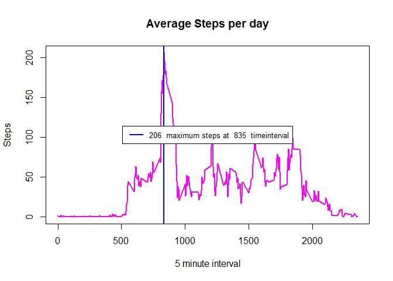

# Reproducible Research Course Project
Noel Temena  
May 12, 2017  
John Hopkins Coursera Project Instructions:

It is now possible to collect a large amount of data about personal movement using activity monitoring devices such as a Fitbit, Nike Fuelband, or Jawbone Up. These type of devices are part of the "quantified self" movement - a group of enthusiasts who take measurements about themselves regularly to improve their health, to find patterns in their behavior, or because they are tech geeks. But these data remain under-utilized both because the raw data are hard to obtain and there is a lack of statistical methods and software for processing and interpreting the data.

This assignment makes use of data from a personal activity monitoring device. This device collects data at 5 minute intervals through out the day. The data consists of two months of data from an anonymous individual collected during the months of October and November, 2012 and include the number of steps taken in 5 minute intervals each day.

Dataset used: [Activity monitoring data](https://d396qusza40orc.cloudfront.net/repdata%2Fdata%2Factivity.zip) [52K] 

The variables included in this dataset are:

   steps: Number of steps taking in a 5-minute interval (missing values are coded as NA)  
   date: The date on which the measurement was taken in YYYY-MM-DD format  
   interval: Identifier for the 5-minute interval in which measurement was taken  

The dataset is stored in a comma-separated-value (CSV) file and there are a total of 17,568 observations in this dataset.

Project requirements:  
1) Code for reading in the dataset and/or processing the data  
2) Histogram of the total number of steps taken each day  
3) Mean and median number of steps taken each day  
4) Time series plot of the average number of steps taken  
5) The 5-minute interval that, on average, contains the maximum number of steps  
6) Code to describe and show a strategy for imputing missing data  
7) Histogram of the total number of steps taken each day after missing values are imputed  
8) Panel plot comparing the average number of steps taken per 5-minute interval across weekdays and weekends  
9) All of the R code needed to reproduce the results (numbers, plots, etc.) in the report  

---

### Start of project documentation  
Load libraries and dataset


```r
setwd("C:/Users/noeltemena/Desktop/Data Science/Reproducible Data/Week2")
library(readr)
library(dplyr)
library(ggplot2)
library(data.table)
library(chron)
dataRead <- read_csv("activity.csv")
mydata <- data.table(dataRead)
```

__What is mean total number of steps taken per day?__  
Calculate the SUM,MEAN and MEDIAN of steps taken each day  
Plot the total sum of steps  


```r
DaySteps <- mydata %>% 
            group_by(date) %>% 
            summarise(
                TotalSteps = sum(steps), 
                MeanSteps = mean(steps),
                MedianSteps = median(steps))
plot(DaySteps$date, DaySteps$TotalSteps, main="Steps taken each day", xlab="October - November 2012", ylab="Sum of Steps", type="h", lwd=6, col="light blue")
```

<!-- -->

Plot the mean and median number of steps taken per day  


```r
plot(DaySteps$date, DaySteps$MeanSteps, main="Mean Steps per day", xlab="October - November 2012", ylab="Mean", type="h", lwd=6, col="green")
abline( h=DaySteps$MedianSteps, col= "blue", lwd= 2)
legend("topright","Median steps per day",cex=.8, col="blue",lty=1, lwd = 2) 
```

<!-- -->
---  
NOTE: Median is ZERO for all the days. To verify the zero values result, I filtered the dataset using a random day and ran the median function.  

```r
testdate <- filter(mydata, date == '2012-10-21')
sapply(testdate, median) 
```

```
##    steps     date interval 
##      0.0  15634.0   1177.5
```

---

__What is the average daily activity pattern?__  
Time series plot of the 5-minute interval (x-axis) and the average number of steps taken, averaged across all days (y-axis)  
Plot includes a vertical line where maximum number of steps occured


```r
TimeSteps <- mydata %>% 
            group_by(interval) %>% 
            summarise(
                TotalSteps = mean(as.numeric(steps), na.rm=TRUE))
plot(TimeSteps$interval,TimeSteps$TotalSteps,main="Average Steps per day", xlab="5 minute interval", ylab="Steps", type="l", lwd=2, col="magenta", xaxt='n')
axis(side =1,tick = 288)
Maxsteps <- max(TimeSteps$TotalSteps)
Maxtime <- filter(TimeSteps,TotalSteps == Maxsteps)
abline( v=Maxtime[1,1], col= "blue", lwd= 2)
legend("center",paste(floor(Maxtime[2])," maximum steps"),cex=.8, col="blue",lwd=2)
```

<!-- -->

---

__Imputing missing values__  

Note that there are a number of days/intervals where there are missing values (coded as NA). The presence of missing days may introduce bias into some calculations or summaries of the data.  

Calculate the total number of missing values in the dataset 

```r
colSums(is.na(mydata))
```

```
##    steps     date interval 
##     2304        0        0
```

Code for filling in all of the missing values (NA's) in the dataset using the mean values of 5 minute interval data frame


```r
#preserve original data by copying data to a new data frame
filled.data <- mydata

### get index limit for table
SampleDataNRow <- nrow(filled.data)
MeanDataNrow <- nrow(DaySteps)

## using the new data frame fill NA with mean time interval numbers 
ii <- 1
for (i in 1:SampleDataNRow) {
    if (is.na(filled.data$steps[i] )){ #flag all NA's
        filled.data$steps[i] <- as.integer(floor(TimeSteps$TotalSteps[ii]))
        }
    if (! i %% 288 ){ #increment or reset index of 5 minute table  
        ii <- 1
    }
    else { ii <- ii + 1}
}
```


Show new dataframe with missing values (NA's) filled in.


```r
head(filled.data)
```

```
##    steps       date interval
## 1:     1 2012-10-01        0
## 2:     0 2012-10-01        5
## 3:     0 2012-10-01       10
## 4:     0 2012-10-01       15
## 5:     0 2012-10-01       20
## 6:     2 2012-10-01       25
```

```r
colSums(is.na(filled.data))
```

```
##    steps     date interval 
##        0        0        0
```


Histogram of the total number of steps taken each day 

```r
#### Make a histogram of the total number of steps taken each day 
Filled.DaySteps <-  filled.data %>% 
                    group_by(date) %>% 
                    summarise(
                        TotalSteps = sum(steps), 
                        MeanSteps = mean(steps),
                        MedianSteps = median(steps))

### plot sum of steps per day
plot(Filled.DaySteps$date, Filled.DaySteps$TotalSteps, main="Steps taken each day (No NA's)", xlab="October - November 2012", ylab="Sum of Steps", type="h", lwd=6, col="light blue")
```

<!-- -->

---


Plot the mean and median total number of steps taken per day.   
Do these values differ from the estimates from the first part of the assignment?  
What is the impact of imputing missing data on the estimates of the total daily number of steps?   

*Mean Plot*


```r
plot(DaySteps$date, DaySteps$MeanSteps, main="Mean steps per day", xlab="October - November 2012", ylab="Mean steps", type="h", lwd=6, col="green")
lines(Filled.DaySteps$date, Filled.DaySteps$MeanSteps, col= "red")
legend("topright",c("Mean steps with NA's", "Mean steps without NA's"),cex=.8, col=c("green","red"),lwd=2)
```

<!-- -->

*Median Plot*


```r
plot(Filled.DaySteps$date, Filled.DaySteps$MedianSteps, main="Median steps taken each day", xlab="October - November 2012", ylab="Median Steps", type="h", lwd=3, col="orange")
lines(DaySteps$date, DaySteps$MedianSteps, col= "red", lwd=2)
legend("topright",c("Median steps without NA's", "Median steps with NA's"),cex=.8, col=c("orange","red"),lwd=2)
```

<!-- -->


---

__Are there differences in activity patterns between weekdays and weekends?__

Create a new factor variable in the dataset with two levels - "weekday" and "weekend" indicating whether a given date is a weekday or weekend day.


```r
checkday <- function(x){ 
    ifelse(is.weekend(x),"weekend","weekday") #check date if weekend or weekday
}
filled.weekdata <- mutate(filled.data,daycheck= checkday(filled.data$date)) #run function and create column
filled.weekdata$daycheck <- as.factor(filled.weekdata$daycheck) ## add class factor

weekdayInterval.data <- filled.weekdata %>%  # create data frame for Weekday time interval
                filter(daycheck == "weekday") %>%
                group_by(interval) %>%
                summarise(TotalSteps = mean(as.numeric(steps), na.rm=TRUE))

weekendInterval.data <- filled.weekdata %>% 
                filter(daycheck == "weekend") %>% # create data frame for Weekend time interval
                group_by(interval) %>%
                summarise(TotalSteps = mean(as.numeric(steps), na.rm=TRUE))
```
New Dataframe with new column for weekday and weekend

```r
head(filled.weekdata)
```

```
##   steps       date interval daycheck
## 1     1 2012-10-01        0  weekday
## 2     0 2012-10-01        5  weekday
## 3     0 2012-10-01       10  weekday
## 4     0 2012-10-01       15  weekday
## 5     0 2012-10-01       20  weekday
## 6     2 2012-10-01       25  weekday
```

Plot containing a time series plot of the 5-minute interval (x-axis) and the average number of steps taken, averaged across all weekdays and weekends (y-axis). 


```r
par(mfrow=c(2,1))
plot(weekdayInterval.data$interval,weekdayInterval.data$TotalSteps,main="Weekday ave. steps per day", xlab="5 minute interval", ylab="Steps", type="l", lwd=2, col="magenta", xaxt='n')
axis(side =1,tick = 288)
plot(weekendInterval.data$interval,weekendInterval.data$TotalSteps,main="Weekend ave. steps per day", xlab="5 minute interval", ylab="Steps", type="l", lwd=2, col="magenta", xaxt='n')
axis(side =1,tick = 288) 
```

<!-- -->

---
